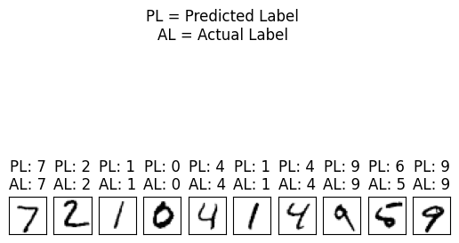
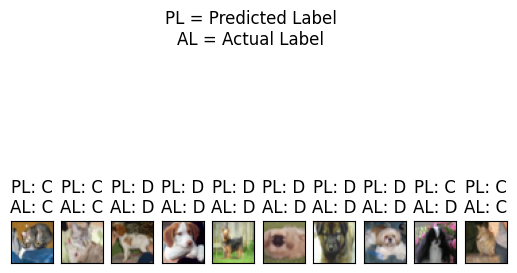
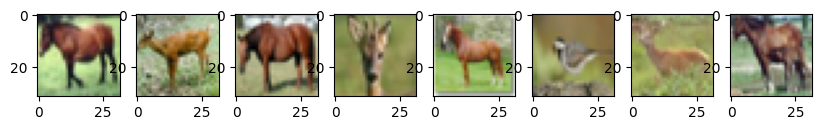
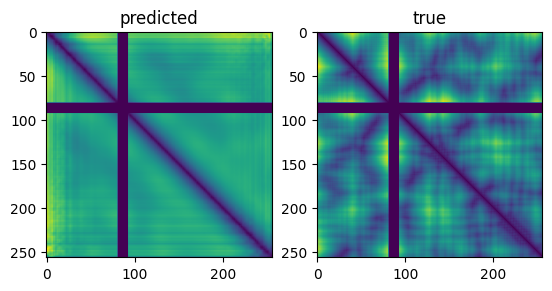
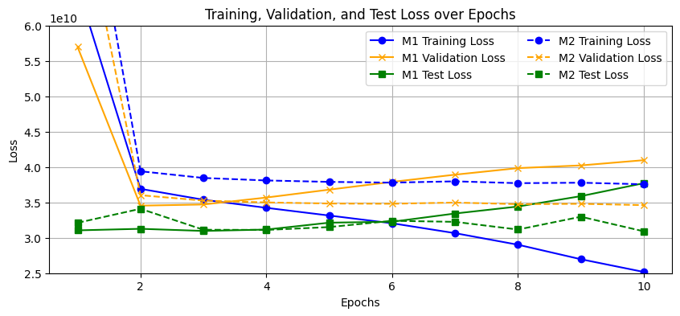

# 💡🧠🤔 Deep Learning Assignments and Projects 🔢🖼️🧬

This repository contains code made in the Deep Learning course at University of Canterbury. It consists of four parts:

| Output                    | Description              | Documentation            |
|:------------------------:|:------------------------:|:------------------------:|
| | CNN prediction of MNIST dataset. Implemented in NumPy. | [Assigment 1 Jupyter Notebook](A1_MNIST/assignement1.ipynb) |
| | CNN prediction of Dogs and Cats in CIFAR dataset. Implemented with NumPy and TensorFlow. | [Assignment 2 Jupyter Notebook](A2_CIFAR/assignment2.ipynb) |
| | Output of a convolution Autoencoder. Implemented with TensorFlow and Keras. | [Assignment 3 Jupyter Notebook](Cosc440_assignment3_AndyMing.ipynb) |
| | Output of a very very lightweight implementation of AlphaFold. Implemented with TensorFlow and Keras. | [Project Documentation](Project_Minifold/COSC440_ProjectDoc_AndyMing.pdf) |
| | Loss-function of two architectures of the implemented AlphaFold knock-off |                           |

## 💾 Data:

The datasets for Assginments 1-3 can be found publicly:
* [MNIST](http://yann.lecun.com/exdb/mnist/)
* [CIFAR](https://www.cs.toronto.edu/~kriz/cifar.html)

The dataset for the project has been provided by UC for this assignment and is not publicly available.

## 🔧 Environment:

All assignments have been done in [Google Colab](https://colab.google/).

## 📥 Contact

Should you have any questions, comments or suggestions please contact Dumbledore 🧙🏼‍♂️.